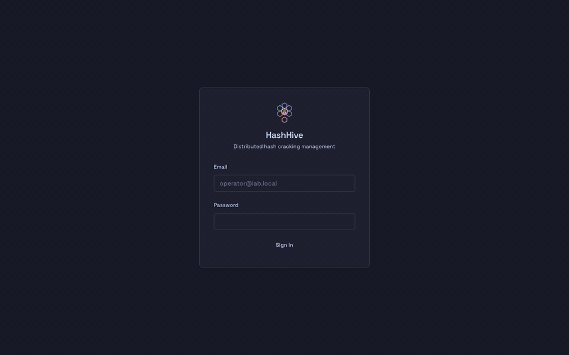

# HashHive

HashHive is a distributed password-cracking platform that orchestrates [hashcat](https://hashcat.net/) across multiple agents on a private LAN. It's a 2026 TypeScript reimplementation of [CipherSwarm](https://github.com/unclesp1d3r/CipherSwarm), built for air-gapped lab environments.

## Operator Console



Multi-project sign-in flow: login → project selector (with "remember this project on next sign-in") → dashboard → sidebar sign-out. Captured via the e2e harness in `packages/frontend/e2e/demo-capture.spec.ts`.

## Stack

| Layer | Tech |
|-------|------|
| Runtime + package manager + test runner | Bun (latest stable) |
| Backend | Hono on `Bun.serve()` |
| Database | PostgreSQL + Drizzle ORM |
| Task queue | Redis + BullMQ |
| Object storage | SeaweedFS (S3-compatible, Apache-2.0) — swappable with AWS S3 in hosted deployments |
| Frontend | React 19 + Vite |
| UI | Tailwind CSS + shadcn/ui (Catppuccin Macchiato dark theme) |
| Server state | TanStack Query v5 |
| Client state | Zustand |
| Monorepo | Turborepo + Bun workspaces |
| Lint + format | oxlint + oxfmt (JS/TS/JSON/CSS), taplo (TOML) |
| Tests | bun:test (unit / integration), Playwright (e2e) |
| Tasks | [just](https://github.com/casey/just) (recommended) |

See [ARCHITECTURE.md](./ARCHITECTURE.md) for the full architectural overview and [.kiro/steering/tech.md](.kiro/steering/tech.md) for the constraints on what NOT to introduce.

## Project Structure

```text
hash_hive/
├── packages/
│   ├── backend/      # @hashhive/backend  — Bun + Hono API
│   ├── frontend/     # @hashhive/frontend — React 19 + Vite UI
│   ├── shared/       # @hashhive/shared   — Drizzle schema, Zod schemas, TS types
│   └── openapi/      # OpenAPI spec for the agent surface (agent-api.yaml); dashboard and control are route-as-spec
├── docker/           # SeaweedFS IAM config + other container assets
├── docs/             # Architecture, development, testing, gotchas, solutions
├── spec/             # Tickets and design specs
└── docker-compose.yml + docker-compose.prod.yml
```

## Prerequisites

- **Bun 1.2+** — runtime, package manager, test runner
- **Docker and Docker Compose**
- **Git**
- **[just](https://github.com/casey/just)** — task runner (recommended)
- **[mise](https://mise.jdx.dev/)** — toolchain pinning (optional but matches CI)

## Quick Start

```bash
git clone <repository-url>
cd hash_hive
bun install
cp packages/backend/.env.example packages/backend/.env
docker compose up -d     # PostgreSQL, Redis, SeaweedFS (+ bucket-init sidecar)
just db-migrate          # Apply Drizzle migrations
just db-seed             # Seed admin user (admin@hashhive.local / changeme123)
just dev                 # Start backend + frontend via Turborepo
```

Or run `just setup` to do most of the above in one step. See [docs/development.md](./docs/development.md) for the full development guide.

### Default ports

| Service | URL | Notes |
|---------|-----|-------|
| Backend API | <http://localhost:4000> | Hono on `Bun.serve()` |
| Frontend UI | <http://localhost:3000> | Vite dev server |
| PostgreSQL | `localhost:5432` | `hashhive` / `hashhive` |
| Redis | `localhost:6379` | — |
| SeaweedFS (S3 API) | <http://localhost:9000> | `minioadmin` / `minioadmin` |
| SeaweedFS (master) | <http://127.0.0.1:9333> | Loopback-only (unauthenticated status page) |

## Common Commands

```bash
# Development
just dev                # Start backend + frontend
just dev-backend        # Backend only
just dev-frontend       # Frontend only

# Build
just build              # Build all packages (Turborepo cached, dependency-ordered)

# Quality gates
just check              # Fast: lint + format + type-check + build (no tests, ~30s)
just ci-check           # Full: lint + format + type-check + build + test (matches CI)

# Tests
just test               # All tests
just test-backend       # Backend (bun:test, isolated phases)
just test-frontend      # Frontend (bun:test)
just test-e2e           # E2E (Playwright)

# Lint + format
just lint               # oxlint (type-aware) across the monorepo
just format             # oxfmt (JS/TS/JSON/CSS) + taplo (TOML)
just type-check         # tsc --noEmit across packages

# Database
just db-generate        # Generate Drizzle migration from schema.ts
just db-migrate         # Apply pending migrations
just db-studio          # Open Drizzle Studio
just db-seed            # Seed admin user + default project
just psql-shell         # psql into the dev database

# Docker
just docker-up          # Start infrastructure services
just docker-down        # Stop
just docker-status      # Service status
just docker-logs        # Tail all
just docker-logs-service <svc>  # Tail one service
```

The two non-negotiable gates: run `just check` after every change task and `just ci-check` before every commit / PR. They are what CI runs.

## API Surfaces

HashHive exposes three distinct API surfaces, each with its own auth, error envelope, and pagination shape:

- **Agent API** (`/api/v1/agent/*`) — pre-shared Bearer token, used by hashcat worker agents. Spec: [`packages/openapi/agent-api.yaml`](./packages/openapi/agent-api.yaml). Never break this surface.
- **Dashboard API** (`/api/v1/dashboard/*`) — BetterAuth cookie session, used by the React frontend. `limit` / `offset` pagination, `{ error: { code, message } }` envelope. Spec is generated from `@hono/zod-openapi` route definitions in `packages/backend/src/routes/dashboard/*` and served anonymously at runtime at `GET /api/v1/dashboard/openapi.json` (no static YAML file).
- **Control API** (`/api/v1/control/*`) — per-user API keys (format `cst_*`), used by CLI tooling / automation / CI / the planned TUI. RFC 9457 problem-details errors (`application/problem+json`), `offset` / `limit` pagination. Spec is generated from `@hono/zod-openapi` route definitions in `packages/backend/src/routes/control/*` and served anonymously at runtime at `GET /api/v1/control/openapi.json` (no static YAML file).

Users issue and rotate Control API keys from the dashboard Account page (`/account`).

## Documentation

- **[AGENTS.md](./AGENTS.md)** — entry point for AI coding assistants; links the rest of the docs
- **[ARCHITECTURE.md](./ARCHITECTURE.md)** — system overview, tech stack, data model, API surfaces
- **[CONTRIBUTING.md](./CONTRIBUTING.md)** — code style, naming, git workflow, PR process
- **[STRATEGY.md](./STRATEGY.md)** — target problem, the five key metrics, the four investment tracks
- **[BACKLOG.md](./BACKLOG.md)** — authoritative status of remaining work
- **[docs/development.md](./docs/development.md)** — environment, commands, infrastructure services, env vars
- **[docs/testing.md](./docs/testing.md)** — test strategy, bun:test patterns, mocking patterns
- **[GOTCHAS.md](./GOTCHAS.md)** — hard-won lessons (TypeScript strict, Hono, Drizzle, BetterAuth, bun:test, frontend JSX)
- **[docs/solutions/](./docs/solutions/)** — searchable knowledge store of past problems with YAML frontmatter

## Deployment

The only supported production deployment is **Docker Compose** in an air-gapped private lab; see [`docker-compose.prod.yml`](./docker-compose.prod.yml). All container images, dependencies, and resources must be fully self-contained — no runtime functionality may depend on external network access. Air-gapped operators must pre-pull the pinned images (`chrislusf/seaweedfs:4.27`, `amazon/aws-cli:2.27.8`, `postgres:16-alpine`, `redis:7-alpine`) before bringing the stack up.

## License

Apache-2.0. Based on the [CipherSwarm](https://github.com/unclesp1d3r/CipherSwarm) architecture.
