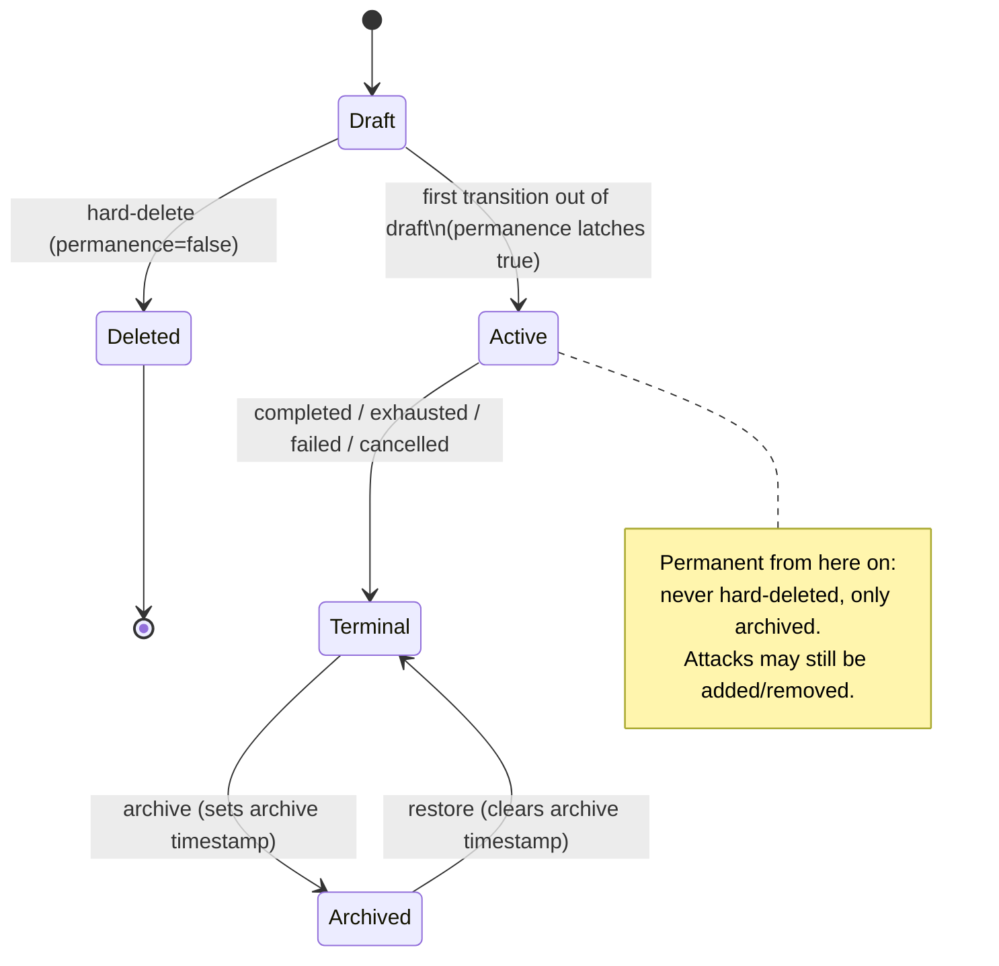

# Campaign Archiving and the Draft-vs-Permanent Lifecycle

## Summary

Add campaign archiving as the first implementation of a general lifecycle rule:
a draft, unused record can be hard-deleted, but once it leaves draft it becomes a
permanent record - archivable to clear it from active views, never deletable, with
all data and crack attribution preserved and restore available. Draft campaigns keep
their existing hard-delete; running or paused campaigns must be stopped before they
can be archived.

## Problem Frame

Operators run many large, multi-stage campaigns concurrently across the fleet. Finished
campaigns (completed, exhausted, failed, cancelled) accumulate in the active dashboard
view with no way to clear them. Today the only removal path is `deleteCampaign`, which is
draft-only (`packages/backend/src/services/campaign-dashboard.ts:151`): any non-draft
campaign returns 409 "Only draft campaigns are deletable." So the active list grows
without bound, and there is no operator-facing way to retire finished work.

The reason deletion is draft-only is deliberate: a campaign records which campaign cracked
each hash via `hash_items.campaign_id`, and that attribution is the forensic record the
results view depends on. Hard-deleting a campaign that has cracked hashes would destroy
that link. The current schema guards against this by simply forbidding the delete.

This was always the intended design - the immutability-on-use rule was planned but not yet
implemented. A record is freely deletable only while it is draft and unused; the moment it
transitions out of draft (runs, gains cracks, gains dependents) it becomes permanent and can
only be archived. Campaign archiving is where that rule first ships.

## Key Decisions

- **The lifecycle rule is general, not campaign-specific.** Draft and unused means deletable;
  used means permanent and archive-only, never deleted. The rule governs campaigns, hash lists,
  and wordlists/resources alike. This document names the principle and specifies it concretely
  for campaigns; resources follow the same rule in follow-on work.

- **Two orthogonal markers, not one.** A latching permanence boolean (false in draft, set true
  one-way when the record first leaves draft) governs deletability. A separate nullable archive
  timestamp governs whether the record is currently archived. They answer different questions -
  a just-completed campaign is permanent but not yet archived - so one flag cannot carry both.
  The archive marker is a timestamp rather than a boolean so it also records when archiving
  happened (useful for sorting the archived list).

- **Permanence governs deletion, not editing.** A non-draft campaign still accepts attacks being
  added and removed. It is the record's existence that is permanent, not its whole composition.

- **Archive terminal campaigns only; keep draft-only hard-delete.** Delete discards worthless
  drafts; archive retires finished work. Two paths, two purposes. Running or paused campaigns
  reach a terminal state (stop) before they qualify for archive.

- **Results need no query change.** The results query already scopes via `hash_lists.project_id`
  and LEFT JOINs campaigns (`packages/backend/src/routes/dashboard/results.ts:101-211`), so an
  archived campaign's cracked hashes keep attributing correctly with the campaign row still
  present.

## Requirements

### Lifecycle and deletability

- R1. Each campaign carries a permanence marker that is false while the campaign is `draft` and
  is set true, one-way, the first time the campaign transitions out of `draft`. It is never
  cleared.
- R2. A campaign is hard-deletable only while its permanence marker is false. The existing
  draft-only delete behavior is the realization of this rule and is preserved.
- R3. A campaign whose permanence marker is true is never hard-deleted. Archive is its only
  removal path.
- R4. Permanence forbids deletion of the record only. A non-draft campaign still accepts attacks
  being added and removed.

### Archive and restore

- R5. A terminal campaign (`completed`, `exhausted`, `failed`, or `cancelled`) can be archived.
  Archiving sets a nullable archive timestamp on the record.
- R6. A `running` or `paused` campaign cannot be archived. It must first reach a terminal state.
- R7. An archived campaign can be restored. Restore clears the archive timestamp and returns the
  campaign to active views in its existing terminal status.
- R8. Archive and restore support selecting and acting on multiple campaigns at once.
- R9. Archive and restore are gated by the same project access controls as delete.

### Visibility

- R10. Active campaign lists and dashboards exclude archived campaigns by default. An explicit
  filter or toggle reveals them.
- R11. The results view continues to show archived campaigns' cracked hashes with full
  attribution by default. No results-query change is required (see Key Decisions).
- R12. Archived campaigns are not schedulable, and restoring one does not make it schedulable -
  it returns to its terminal status, which is already non-schedulable.

### General rule

- R13. The draft-vs-permanent rule applies to records generally: a draft, unused record (no
  cracks and no referencing campaigns or dependents) is deletable; once used it is permanent and
  archive-only. This document specifies campaigns; hash lists and wordlists/resources adopt the
  same rule in later work.

## Acceptance Examples

- AE1. Covers R1, R2. **Given** a draft campaign that has never run, **when** the operator deletes
  it, **then** the delete succeeds and the record is removed.
- AE2. Covers R3, R5. **Given** a completed campaign, **when** the operator attempts to delete it,
  **then** the delete is rejected; **when** the operator archives it instead, **then** archive
  succeeds and the record (and its crack attribution) is preserved.
- AE3. Covers R6. **Given** a running campaign, **when** the operator attempts to archive it,
  **then** archive is rejected with guidance to stop the campaign first.
- AE4. Covers R7. **Given** an archived campaign that was `completed`, **when** the operator
  restores it, **then** it reappears in active views with status `completed` and no archive
  timestamp.
- AE5. Covers R11. **Given** a hash cracked by a now-archived campaign, **when** the operator views
  results, **then** the cracked row still appears, attributed to that campaign, scoped to the
  project via its hash list.
- AE6. Covers R4. **Given** a non-draft campaign, **when** the operator adds or removes an attack,
  **then** the edit succeeds; a delete of the same campaign is still rejected.

## Scope Boundaries

### Deferred for later

- Applying the draft-vs-permanent rule concretely to resources (wordlists, hash lists, rulelists,
  masklists). Same principle, separate effort.
- Auto-archiving by age or rule. Archive and restore are manual operator actions only.

### Outside scope

- Any purge or hard-delete path for archived (permanent) records. Archive preserves; nothing
  destroys the record.

## Dependencies / Assumptions

- Campaign status lifecycle is `draft`, `pending`, `running`, `paused`, `completed`, `exhausted`,
  `failed`, `cancelled` (`packages/shared/src/db/schema.ts:534`). Only `draft` is non-permanent.
- The results query already scopes via `hash_lists.project_id` and LEFT JOINs campaigns, so
  archived campaigns' cracks attribute correctly with no change.
- The agent API is unaffected. Archived campaigns are terminal; agents never act on them. The
  agent surface stays untouched.
- `hash_items.campaign_id` remains the attribution link. Under this rule it effectively never goes
  null through deletion, because any campaign with cracks is permanent and cannot be hard-deleted.

## Outstanding Questions

### Deferred to Planning

- Exact schema deltas (the permanence-marker column and the archive-timestamp column), the
  migration, and backfilling existing non-draft campaigns so their permanence marker reads true.
- Whether GitHub issue #207's testcontainers tests exercise the real HTTP route (real auth/RBAC)
  or the query path directly. This decision was deferred when #207 was parked behind this work.
- UI treatment of archived campaigns: how the archived state is marked in the results view, and
  the shape of the archived-campaigns list/filter.
- Bulk archive/restore interaction details.

## Sources / Research

- `packages/backend/src/services/campaign-dashboard.ts:151` - `deleteCampaign`, draft-only guard
  enforced atomically in the DELETE WHERE clause.
- `packages/backend/src/routes/dashboard/results.ts:101-211` - `buildResultFilters`, hash-list
  project scoping, LEFT JOIN of campaigns that keeps deleted/archived-campaign rows visible.
- `packages/shared/src/db/schema.ts:534` - `campaigns` table (status, no soft-delete column today);
  `hash_items.campaign_id` is `ON DELETE SET NULL`; `campaigns.hash_list_id` is NOT NULL.
- GitHub issue #207 - testcontainers-backed Results-filter tests, parked behind this work; they
  will assert the archived-attribution behavior once archiving lands.
- ADR-0019 (`docs/adr/0019-campaign-archiving-immutable-lifecycle.md`) - records this decision.
