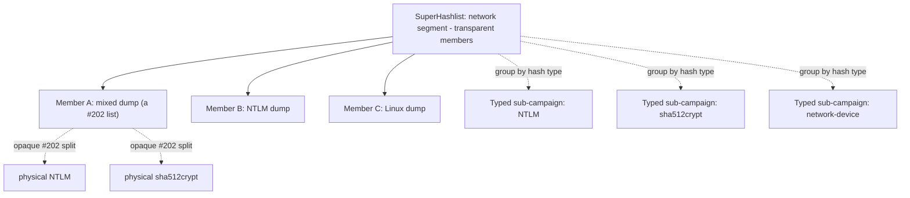

# SuperHashlists — Cross-Hashlist Deduplication

## Summary

Add a **SuperHashlist**: a virtual hash list that a campaign can target like any ordinary list, but whose contents are the live union of several independent hash lists — deliberately spanning *different* hash types (e.g., "all uncracked hashes for this network segment": Windows, Linux, and network-device hashes together). The super dedupes per hash type across its members and propagates cracks everywhere a value appears, so the fleet cracks each unique hash once. Because hashcat attacks one mode at a time, targeting a super groups its hashes by type and reuses #202's mixed-type split to spawn one typed sub-campaign per type present. It is realized as a query-time virtual union: the super stores no hashes of its own.

## Problem Frame

Operators run multiple concurrent engagements, and the same hash frequently recurs across separate dumps — a credential harvested last month reappears in a fresh list this week. Today the zap system only dedupes *within a single shared hash list* (`hash_items` is unique on `(hashListId, hashValue)`, and `getZapsForTask` filters to one list). Across separate lists there is no dedup, so the fleet burns GPU-hours re-cracking hashes whose plaintext is already known — directly eroding crack yield per GPU-hour, the product's core metric.

The operator's real unit of work is often not a single dump but a *segment of the network*: the hashes they care about span many lists and many types at once. There is no entity that represents "all uncracked hashes for this segment" as a single thing a campaign can attack.

## Key Decisions

- **Virtual union, not materialized (Approach A).** The super is a hash-list-like record that owns no hash items; membership, dedup, zaps, progress, and results resolve at read time by expanding to member lists. Chosen because liveness, retroactive back-fill, and crack-once fall out of the design rather than requiring a propagation engine that keeps physical copies in sync.
- **Mixed hash types are the point, not an edge case.** A super draws on the same type-grouping situation as #202 — #202 splits *one* mixed list into typed sub-campaigns; a super sources that from *many* lists — so dedup is per hash type.
- **Composition is transparent, unlike #202.** #202's split is opaque: the operator sees one hash list and can never address the physical typed lists beneath it. A super is the opposite — its members are discrete, user-visible hash lists the operator adds, removes, inspects, and targets individually. A member may itself be a #202 list (opaque internally), so a super composes *logical* hash lists that each resolve down to one or more physical lists. The super sits one layer above #202, not in place of it.
- **Reuse #202 for per-type fan-out.** Targeting a super groups its unioned hashes by type and produces the typed sub-campaign/attack structure #202 already generates — one attack pipeline per type present. Operators do not author per-type attacks by hand.
- **Membership: at most one super, still independent.** A list belongs to at most one super at a time and remains directly targetable by its own campaigns while a member.
- **Crack-once is project-wide, not super-gated.** Dedup and zap propagation apply automatically across every hash sharing a `(resolved hashcat mode, value)` within a project — protecting crack-yield-per-GPU-hour without manual curation. The SuperHashlist is a targeting/grouping/export convenience on top; it groups lists for campaign assignment and export but does not gate dedup. Cross-list zaps are served from a maintained project-scoped cracked-`(mode, value)` set so the agent's zap poll stays a single indexed lookup — the cost moves to write-time (once per crack), and the sacred agent hot path keeps its single-scan shape.
- **One shared node-resolution layer for splits and unions.** #202's split (parent → typed physical children) and a super's union (group → member leaves, each possibly itself a #202 list) both resolve through a single "resolve node → leaf lists grouped by type" layer. Targeting a mixed super fans out per type through this shared layer; #202's one-physical-list split is refactored onto it rather than assumed to consume a union source unchanged.
- **Propagation is plaintext-only, with an audited match reference.** Marking a duplicate cracked copies only the recovered plaintext and crack state — never the originating list's `user`/`source` provenance (mirroring #102's boundary). The cross-list match is recorded in the audit/metadata trail without exposing the source list to the target list's viewers.
- **Dedup keys on the exact hashcat mode.** Two identical strings under different modes are different hashes (a 32-hex string can be raw-MD5 or NTLM with unrelated plaintexts), so dedup and crack-once key on `(resolved hashcat mode, value)`. Items without a resolved mode do not cross-list dedup until classified.
- **Removal harvests plaintext.** Removing a member is allowed at any time; before detaching, plaintext known only through that member is copied to remaining members sharing the value so nothing reverts to uncracked, and in-flight tasks for the removed member's hashes are drained. This is the one write-back exception to the otherwise read-time-virtual model.
- **The agent API is unaffected.** Supers are a server-side and operator-facing construct. Agents keep receiving concrete per-task hash lists and zap skip-lists; the sacred agent contract does not change.

## Actors

- A1. **Red team operator** — creates a super, manages its membership, targets campaigns at it, and reviews aggregated results across the union.
- A2. **Server / orchestrator** — resolves membership, groups the union by hash type, generates the typed sub-campaigns, and computes zaps, progress, and results over the deduplicated union.
- A3. **hashcat agent** — unchanged. Receives concrete per-task hash lists and zap skip-lists; never sees the super abstraction.

## Requirements

**Model & membership**

- R1. A SuperHashlist is accepted wherever an ordinary hash list is — as a campaign target, an export source, and a results/analysis subject — operating over its deduplicated union. It is fundamentally a grouping/alias that lets several lists be treated as one for these operations.
- R2. A super unions two or more independent hash lists (members), which may be of differing hash types. A member is a discrete, individually addressable hash list and may itself be a #202 mixed list (whose internal physical splits stay opaque).
- R3. A hash list belongs to at most one super at a time, and remains independently targetable by its own campaigns while a member.
- R4. Membership is dynamic — members can be added or removed after the super is created.
- R5. A super and its members belong to a single project.

**Deduplication & result propagation**

- R6. The super's contents are the live union of its members' hash items, deduplicated per `(resolved hashcat mode, hash value)`; identical strings under different modes are distinct hashes, and items with no resolved mode do not cross-list dedup until classified.
- R7. A crack of a hash is treated as cracked for that `(resolved hashcat mode, value)` everywhere it appears within the project — served from the maintained cracked-set (R16), not written back to other lists' rows (R14 is the sole write-back exception).
- R8. Any campaign — whether it targets a super or an ordinary list — skips (zaps) hashes already cracked anywhere in the project with the same `(resolved hashcat mode, value)`, served from the maintained cracked-set (R16).
- R9. Adding a member retroactively reconciles cracked state both ways: already-cracked hashes in any member mark their duplicates cracked, and hashes later added to a member appear in the super.
- R10. The super owns no hash items of its own; union, dedup, and zaps resolve at read time.
- R14. Removing a member is permitted at any time. To avoid losing a concurrently-submitted crack, the platform first drains/quiesces in-flight tasks for the member's hashes, then snapshots and harvests under a lock — copying plaintext known only via that member to remaining members sharing the value — then detaches it. This plaintext harvest is the sole write-back to the otherwise read-time-virtual model.
- R15. Every surface that reads crack state or plaintext for a super or its members — zaps, campaign progress (R12), results/analysis, and export — resolves through the union/dedup layer rather than reading a list's own `crackedAt`/`plaintext` directly, so a hash cracked in a different list is never reported uncracked.
- R16. Crack-once dedup is project-scoped and automatic: a maintained per-project set of cracked `(resolved hashcat mode, value)` is updated on each crack and is the source for zap resolution, so cross-list dedup applies to every list in the project without requiring a SuperHashlist. The agent zap poll consults this set as a single indexed lookup.
- R17. Propagation copies only recovered plaintext and crack state, never the originating list's `user`/`source` provenance; a cross-list match is recorded in the audit/metadata trail without exposing the source list to the target list's viewers.

**Campaign integration**

- R11. Targeting a super with a campaign groups its unioned hashes by hash type and produces one typed sub-campaign/attack pipeline per type present, via the shared node-resolution layer that expands both #202 splits and super unions to typed leaf lists (see Key Decisions).
- R12. Progress, ETA, and results for a super-targeted campaign aggregate across members over the deduplicated union.

**Surfaces**

- R13. Operators can create, name, and manage the membership of a super from the dashboard, with equivalent capability on the Control API. Super creation and membership management are gated by the same project access controls as hash-list creation and deletion. The agent API is unchanged.

## Key Flows

- F1. Create a super and populate it
  - **Trigger:** Operator wants one attackable pool for a network segment spanning several dumps.
  - **Actors:** A1, A2
  - **Steps:** Operator creates a super within a project; adds member lists; server validates each member belongs to the project and to no other super; server reconciles cracked state across the new membership (R9).
  - **Covered by:** R2, R3, R4, R5, R9

- F2. Run a campaign against a mixed-type super
  - **Trigger:** Operator starts a campaign whose target is a super.
  - **Actors:** A1, A2, A3
  - **Steps:** Server resolves membership and the deduplicated union; groups by hash type; generates one typed sub-campaign per type via #202's split; agents receive concrete per-task hash lists and crack them.
  - **Covered by:** R1, R6, R10, R11, R12, R13

- F3. Crack propagation and universal zap
  - **Trigger:** An agent submits a crack for a hash present in more than one member.
  - **Actors:** A2, A3
  - **Steps:** Server records the crack against the member the task belongs to; the read-time union makes the `(type, value)` cracked everywhere it appears; subsequent zap requests for *any* member campaign skip it.
  - **Covered by:** R7, R8, R10

## Acceptance Examples

- AE1. **Covers R6.** A super unions list A (an NTLM hash `X`) and list B (an MD5 hash whose value is also the string `X`). The super holds both as distinct hashes; cracking the NTLM `X` does not mark the MD5 `X` cracked.
- AE2. **Covers R8.** List A and list B are members of super S. A hash `H` (same type) is present in both. Operator runs a campaign against list A *directly* (not S). Once `H` is cracked, a running campaign against list B skips `H`.
- AE3. **Covers R9.** List B (containing an already-cracked hash `H`) is added to super S, which also contains an uncracked duplicate of `H` in list A. Immediately after the add, list A's `H` is treated as cracked without re-running an attack.
- AE4. **Covers R11.** A super contains NTLM, sha512crypt, and network-device hashes. A single campaign targeting it launches three typed sub-campaigns, one per type; no type is attacked with the wrong mode.
- AE5. **Covers R14.** Hash `H` is cracked only in member A, with an uncracked duplicate in member B. Operator removes A from the super. Before detach, B's `H` is set cracked with A's plaintext; removing A does not revert `H` to uncracked or trigger a re-attack.
- AE6. **Covers R14.** While a super-targeted campaign runs, an operator removes member A whose in-flight task is mid-attack on hash `H`. Because tasks are drained before the harvest snapshot, no crack is lost: it either lands before drain (and is harvested) or is re-driven under the remaining members. `H` never silently reverts to uncracked.

## Scope Boundaries

- Materialized/propagation-engine implementation (Approach B) is rejected. Approach C's premise — dedup as a cross-list project property rather than an entity-gated feature — is adopted for dedup scope (R16), but the SuperHashlist entity is retained for grouping/targeting/export, so "no entity" remains rejected.
- Operator-authored per-type attack configuration for supers — fan-out is automatic via #202.
- Cross-project supers — membership is project-scoped.

## Dependencies / Assumptions

- Depends on #98 (Hash Item Storage, Crack Tracking & Zap system) — **closed/available**. Supers union the `hash_items` those systems produce.
- Depends on #202 (detect mixed hash types → split into typed sub-campaigns); #202's split and super fan-out are refactored onto one shared node-resolution layer (Key Decisions), so planning may need to change #202 rather than only consume it.
- Related: #21 (Hash Analysis Service) for per-list/per-item type classification; #102 (Hash Export/Import/Search) — exporting a super returns its deduplicated union (R1).

## Outstanding Questions

**Deferred to planning**

- Membership storage shape — a dedicated membership table vs. extending the existing `parentHashListId` hierarchy. Note: `parentHashListId` is already used by #202 for split children, and a split child is a natural super member, so the single-parent FK likely cannot be reused directly.
- Concrete design of the shared node-resolution layer and the refactor of #202's split onto it (committed in Key Decisions; the how is planning's).
- Concrete design of the maintained per-project cracked-`(mode, value)` set (R16) — storage, update path on crack, and invalidation.
- How super progress/ETA feed the existing fleet metrics (crack yield, time-to-first-crack, ETA accuracy).
- Super archival and deletion semantics relative to member lifecycle.

## Sources / Research

- `packages/shared/src/db/schema.ts` — `hash_lists` (incl. `parentHashListId`, `hashTypeId`, `typeAnalysis`), `hash_items` (unique `(hashListId, hashValue)`), `campaigns.hashListId` (NOT NULL FK).
- `packages/backend/src/services/tasks/zaps.ts` — `getZapsForTask`; current comment notes it deliberately does not expand parents (single leaf list per task).
- `packages/backend/src/services/tasks.ts` — `updateTaskProgress`; crack upsert on `(hashListId, hashValue)` with no cross-list propagation today.
- #202 (merged) — mixed-type detection and split into typed sub-campaigns; the mechanism R11 reuses.
- `docs/hash_hive_gap_analysis.md` (P1-3) and CipherSwarm issue #623 — origin of the cross-hashlist dedup requirement.
- `CONCEPTS.md` — Hash List / Hash Item / Campaign / Zap definitions; the within-shared-list dedup this feature generalizes across lists.
