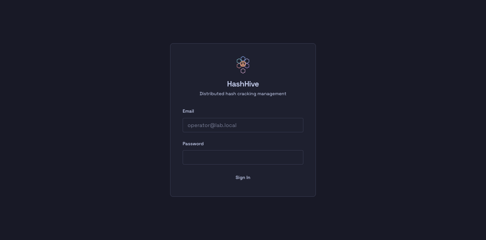
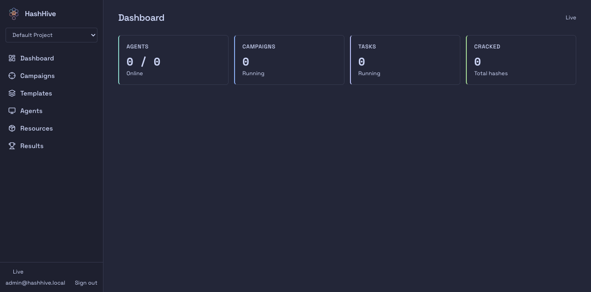
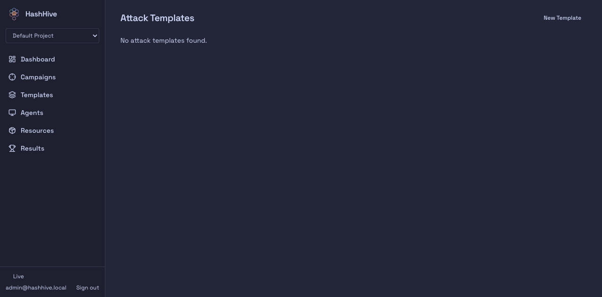
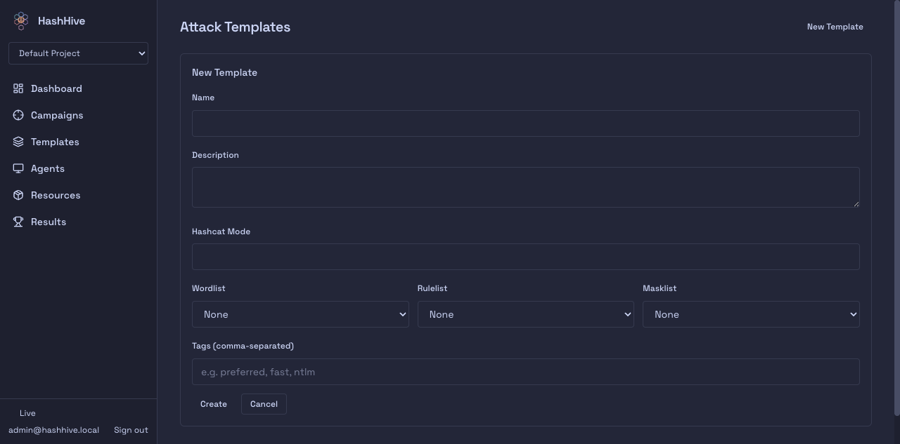
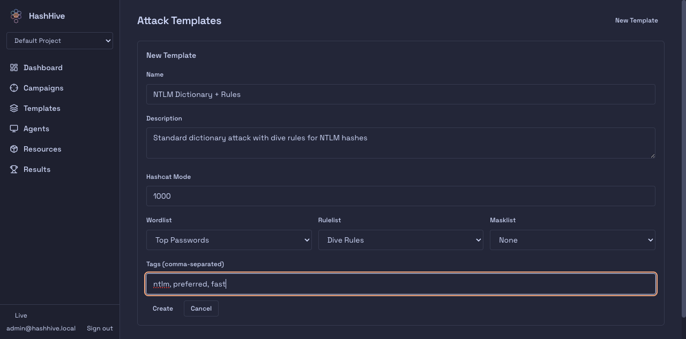
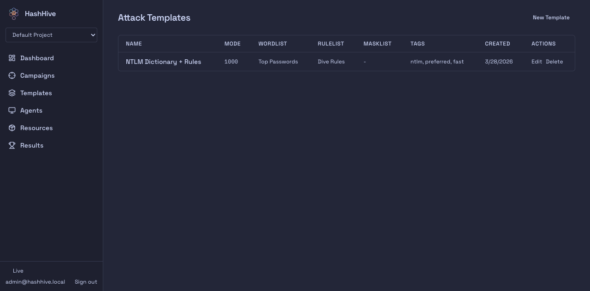
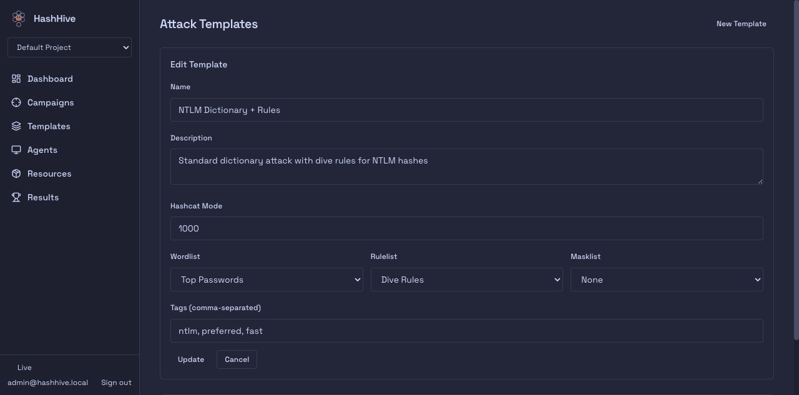
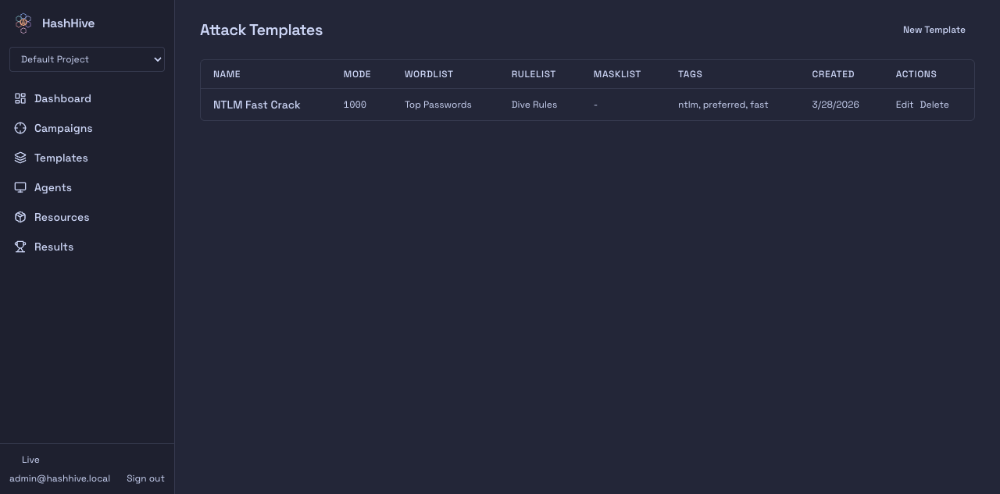

# Attack Templates

Attack templates are reusable, project-scoped attack configurations that let operators define common hashcat setups once and reuse them across campaigns. Templates capture the attack mode, resource selections (wordlists, rulelists, masklists), and tags for categorization.

## Video Walkthrough

<video src="demo.mp4" controls width="100%"></video>

*If the video doesn't render, open [demo.mp4](demo.mp4) directly.*

## User Flow

### 1. Sign In

The dashboard requires authentication. Sign in with your credentials to access attack templates.

### 2. Dashboard

After signing in, the dashboard shows an overview of agents, campaigns, tasks, and cracked hashes. The sidebar navigation includes a **Templates** link.

### 3. Templates -- Empty State

The Templates page shows an empty state when no templates exist, with a **New Template** button available to users with the `admin` or `contributor` role.

### 4. Create a Template

Clicking **New Template** opens the create form with the following fields:

- **Name** -- unique within the project (enforced by a database constraint)
- **Description** -- optional free-text description
- **Hashcat Mode** -- the numeric hashcat attack mode (e.g., 1000 for NTLM)
- **Wordlist / Rulelist / Masklist** -- dropdowns populated from the project's uploaded resources
- **Tags** -- comma-separated labels for categorization and filtering

### 5. Fill In Template Details

Here we configure an NTLM dictionary attack with the "Top Passwords" wordlist and "Dive Rules" rulelist, tagged for quick identification.

### 6. Template Appears in List

After creation, the template appears in the list table with columns for name, mode, resolved resource names, tags, creation date, and action buttons (Edit / Delete).

### 7. Edit a Template

Clicking **Edit** re-opens the form pre-populated with the template's current values. All fields are editable.

### 8. Updated Template

After saving, the list reflects the updated name. The template can be further edited or deleted.

## API Endpoints

| Method | Path | Description |
|--------|------|-------------|
| `GET` | `/api/v1/dashboard/attack-templates` | List templates (supports `limit` and `offset` query params) |
| `POST` | `/api/v1/dashboard/attack-templates` | Create a template |
| `GET` | `/api/v1/dashboard/attack-templates/:id` | Get a single template |
| `PATCH` | `/api/v1/dashboard/attack-templates/:id` | Update a template |
| `DELETE` | `/api/v1/dashboard/attack-templates/:id` | Delete a template |
| `POST` | `/api/v1/dashboard/attack-templates/import` | Import a template definition |
| `POST` | `/api/v1/dashboard/attack-templates/:id/instantiate` | Extract an attack payload from a template |

All endpoints require authentication and project scope (`X-Project-Id` header). Create, update, delete, and import require the `admin` or `contributor` role.

## Data Model

Templates are stored in the `attack_templates` table with the following key constraints:

- **Unique name per project** -- `(project_id, name)` unique index prevents duplicate names within a project. Attempts to create or rename to a duplicate return `409 Conflict`.
- **Foreign keys** -- `project_id`, `hash_type_id`, `wordlist_id`, `rulelist_id`, `masklist_id`, and `created_by` reference their respective tables.
- **Tags** -- stored as a PostgreSQL `text[]` array.
